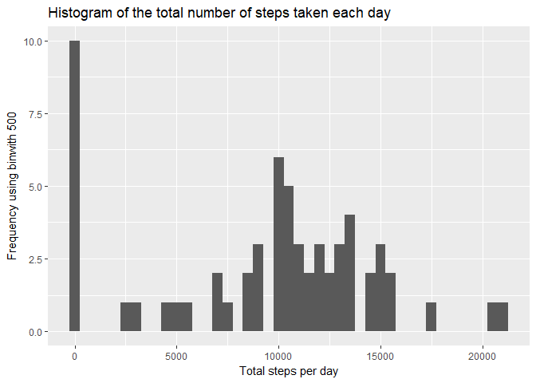
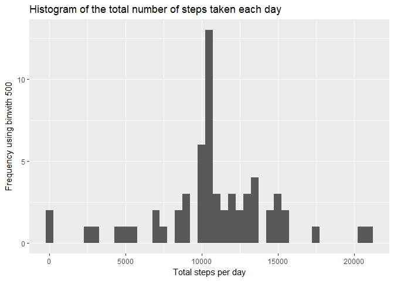

Reproducible Research - Week 2 Assignment
=========================================

1. Loading and preprocessing of data
------------------------------------

        fileurl <- "https://d396qusza40orc.cloudfront.net/repdata%2Fdata%2Factivity.zip"
        zipfile <- "./course5week2/data.zip" 
        # for downloading the file as data.zip to the folder course4week4 under the working
        # directory
        filedir <- "./course5week2"
        unzip_path <- "./course5week2/data"  ##### path for storing the unzipped files #######
        if (!file.exists(filedir)){
            dir.create(filedir)
        }
        download.file(fileurl,file.path(zipfile))
        unzip(zipfile,exdir=unzip_path) ####### exdir is the extract directory ##########
        datafile <- file.path(unzip_path,"activity.csv")
        
        activity <- read.csv(datafile)
        
        activity$date <- ymd(activity$date)
        activity$weekend <- as.factor(ifelse(weekdays(activity$date)=="Saturday" | weekdays(activity$date)=="Sunday","weekend","weekday"))
        activity$dayofweek <- as.factor(weekdays(activity$date))

2. Histogram of the total number of steps taken each day
--------------------------------------------------------

      # Compute the total number of steps per day
      stepsByDay <- activity %>% group_by(date) %>% summarise(stepsperday = sum(steps,na.rm = TRUE))
        qplot(stepsperday,data=stepsByDay,na.rm=TRUE,binwidth=500,xlab='Total steps per day', ylab='Frequency using binwith 500',main = 'Histogram of the total number of steps taken each day')

3. Mean and median number of steps taken each day
-------------------------------------------------

      meanstepsperday <- stepsByDay %>% summarise(average = mean(stepsperday,na.rm = TRUE),median=median(stepsperday,na.rm = TRUE))
      meanstepsperday

    ## # A tibble: 1 x 2
    ##   average median
    ##     <dbl>  <int>
    ## 1 9354.23  10395

4. Average daily activity pattern
---------------------------------

### 4.1 time series plot of the 5-minute interval and the average number of steps across all days

      interval_average <- activity %>% group_by(interval) %>% summarise(average = mean(steps,na.rm = TRUE))
      qplot(interval,average,data=interval_average,geom="line",xlab = "5-minute intervals",ylab = "Average steps taken across all days")

### 4.2 Which 5-minute interval, on average across all the days in the dataset, contains the maximum number of steps?

      interval_average[which.max(interval_average$average),]

    ## # A tibble: 1 x 2
    ##   interval  average
    ##      <int>    <dbl>
    ## 1      835 206.1698

5. Imputing missing values
--------------------------

      # subset dataset where there are no NAs
        activity_no_NA <- activity[which(!is.na(activity$steps)),]
      
      # calculate the mean steps for each interval
        interval_only <- activity_no_NA %>% group_by(interval) %>% summarise(average=mean(steps))

        # convert the average to integer
        interval_only$average <- as.integer(interval_only$average)
        
        #subset dataset where steps have NAs
        activity_na <- activity[which(is.na(activity$steps)),]
        
        # fill NAs with average steps based on interval
        activity_na$steps <- ifelse(activity_na$interval==interval_only$interval,interval_only$average)
        
        # row bind the datasets that do not have NAs and the dataset where NAs are replaced with
        # mean values
        activity_impute <- rbind(activity_no_NA,activity_na)

### 5.1 Number of missing values in the dataset

      # subset dataset where there are no NAs
        nrow(activity_na)

    ## [1] 2304

6.1 Histogram of the total number of steps taken each day after missing values are imputed
------------------------------------------------------------------------------------------

      # Compute the total number of steps per day
      stepsByDay_impute <- activity_impute %>% group_by(date) %>% summarise(stepsperday = sum(steps))
        qplot(stepsperday,data=stepsByDay_impute,na.rm=TRUE,binwidth=500,xlab='Total steps per day', ylab='Frequency using binwith 500',main = 'Histogram of the total number of steps taken each day')

6.2 Mean and median number of steps taken each day
--------------------------------------------------

      totalstepsperday_impute <- activity_impute %>% group_by(date) %>% summarise(stepsperday = sum(steps))
      mean_n_median <- totalstepsperday_impute %>% summarise(average=mean(stepsperday),median=median(stepsperday))
      mean_n_median

    ## # A tibble: 1 x 2
    ##    average median
    ##      <dbl>  <int>
    ## 1 10749.77  10641

7. Are there differences in activity patterns between weekdays and weekends?
----------------------------------------------------------------------------

      meansteps <- activity_impute %>% group_by(interval,weekend) %>%   summarise(average = mean(steps))
      qplot(interval,average,data=meansteps,geom="line",facets=weekend~.,xlab="5-minute interval",ylab="average number of steps",main="Average steps pattern between Weekday and Weekend")

